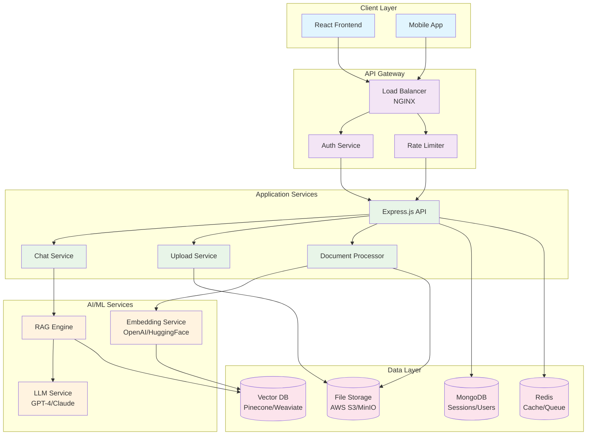
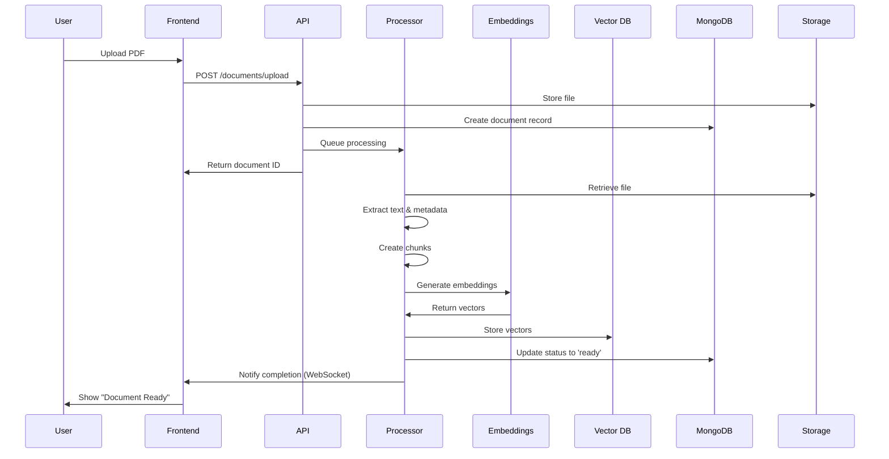
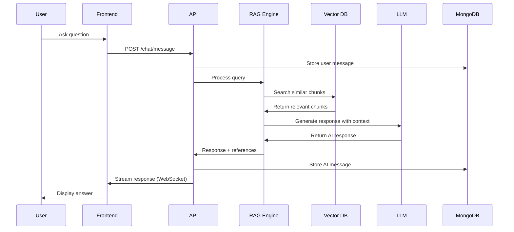
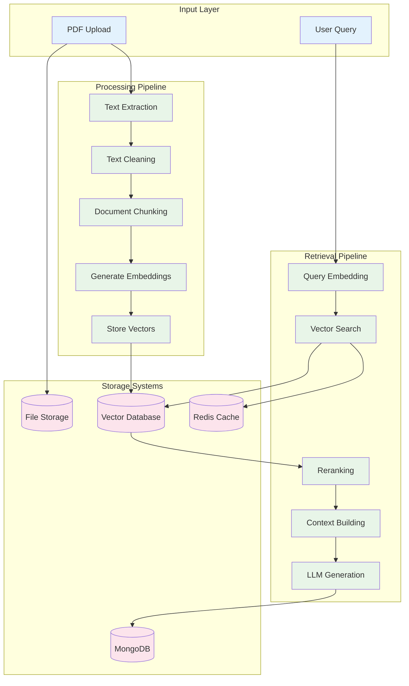
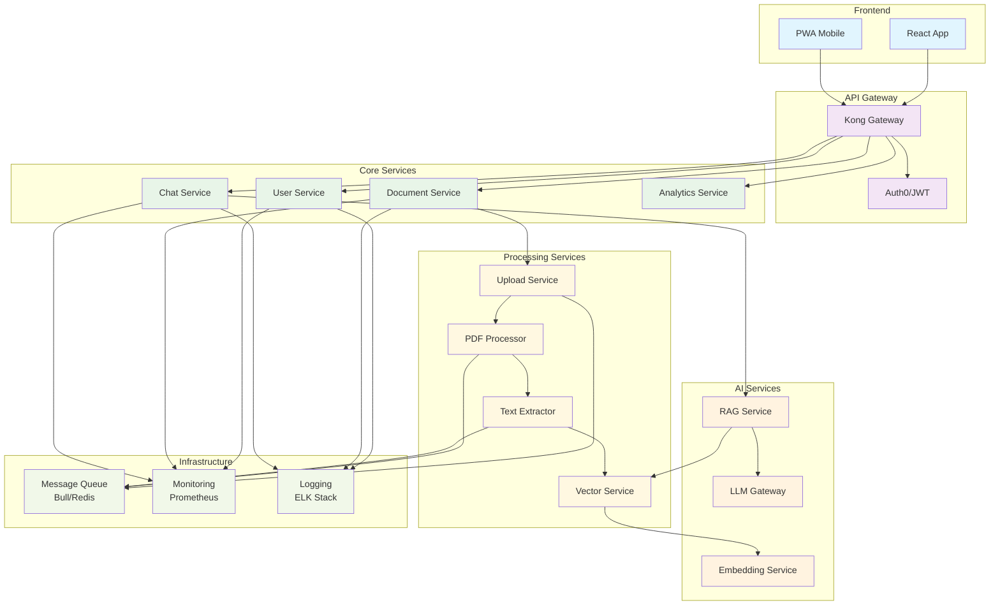
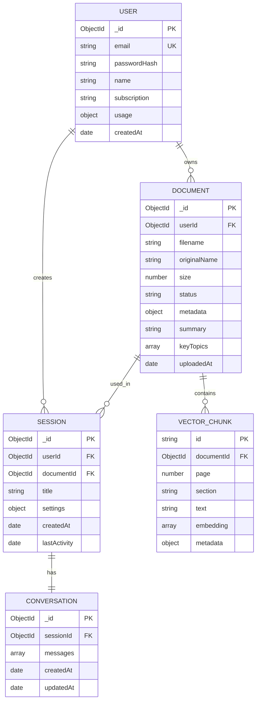
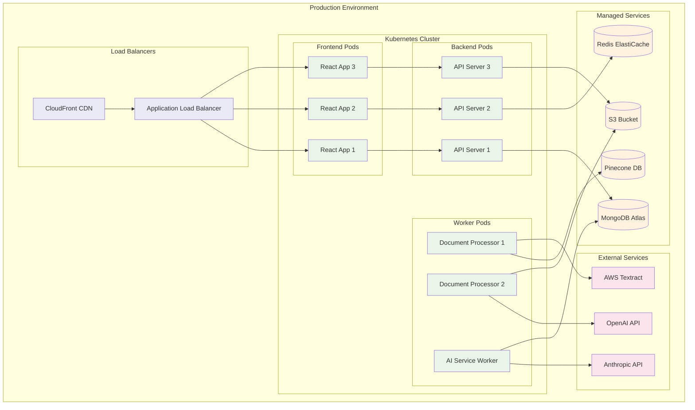
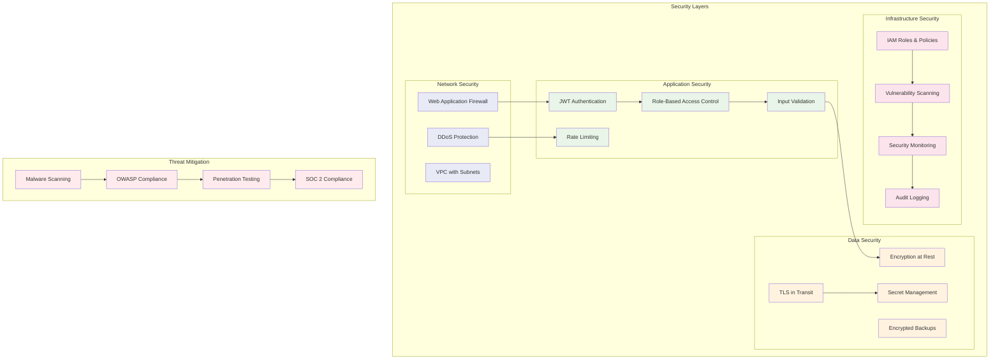

# TLDR AI - System Architecture Diagrams

## High-Level System Architecture

## Document Processing Flow

## Chat Interaction Flow

## Data Flow Architecture

## Microservices Architecture

## Database Schema Relationships

## Deployment Architecture

## Security Architecture

These diagrams provide comprehensive visual representations of your TLDR AI system architecture, covering all aspects from high-level system design to detailed security considerations. Each diagram can be rendered using Mermaid in your documentation platform or converted to images for presentations.
